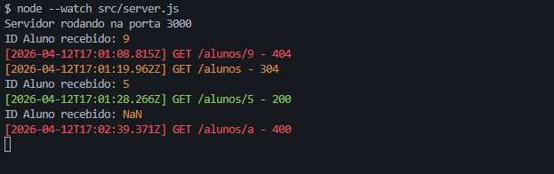
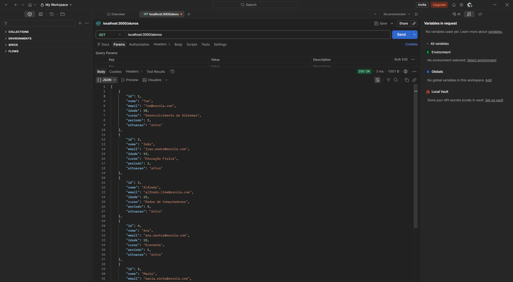
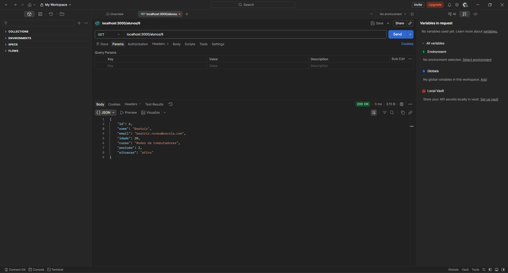
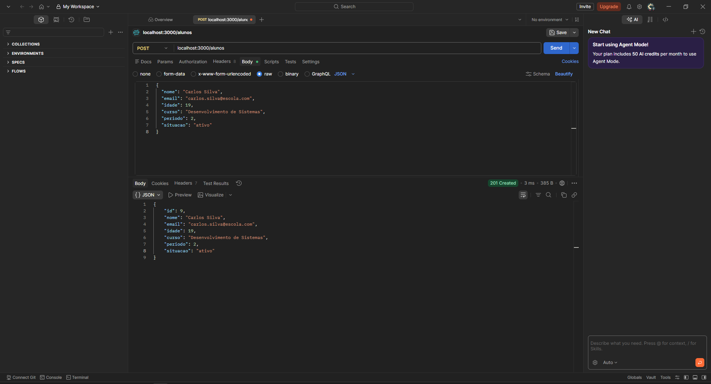
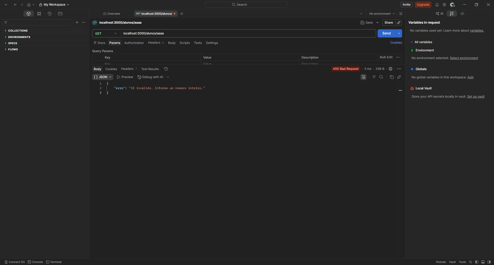
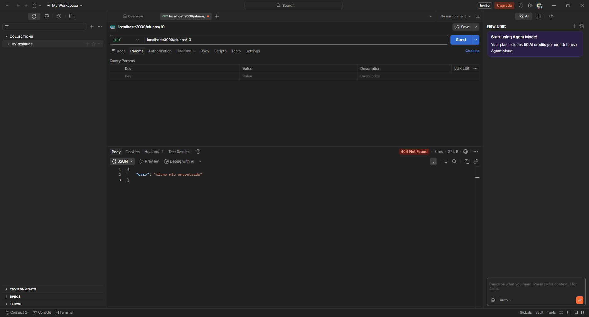
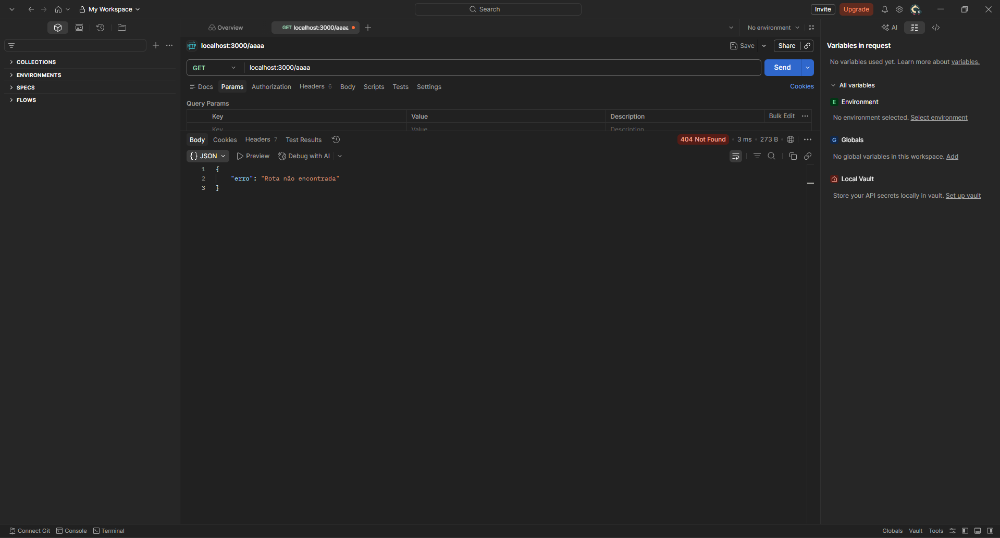

# API de Alunos

## Instalação das dependências

```bash
npm init -y
npm install express colors
```

## Como rodar

```bash
node src/server.js
```

## Rodar e acompanhar as alterações em tempo real

```bash
node --watch src/server.js
```

## Estrutura de pastas

```
projeto/
├── src/
│   ├── controllers/
│   │   └── controller.js
│   ├── data/
│   │   └── alunos.js
│   ├── middlewares/
│   │   └── logger.js
│   ├── routes/
│   │   └── routes.js
│   └── server.js
├── prints/
│   ├── errors/
│   │   ├── erro-400-id-invalido.png
│   │   └── erro-404-rota-inexistente.png
│   ├── success/
│   │   ├── sucesso-listar-todos.png
│   │   ├── sucesso-busca-id.png
│   │   └── sucesso-cadastro.png
│   └── terminal-logger.png
├── package.json
└── README.md
```

## Endpoints

| Método | Rota        | Descrição             |
|--------|-------------|-----------------------|
| GET    | /alunos     | Lista todos os alunos |
| GET    | /alunos/:id | Busca aluno pelo id   |
| POST   | /alunos     | Cadastra novo aluno   |

## Exemplos de resposta

### GET /alunos — Sucesso (200)
```json
[
  { "id": 1, "nome": "Tom", "email": "tom@escola.com", "idade": 20, "curso": "Desenvolvimento de Sistemas", "periodo": 3, "situacao": "ativo" }
]
```

### GET /alunos/1 — Sucesso (200)
```json
{ "id": 1, "nome": "Tom", "email": "tom@escola.com", "idade": 20, "curso": "Desenvolvimento de Sistemas", "periodo": 3, "situacao": "ativo" }
```

### POST /alunos — Cadastro com sucesso (201)

Body enviado:
```json
{
  "nome": "Carlos Silva",
  "email": "carlos.silva@escola.com",
  "idade": 21,
  "curso": "Desenvolvimento de Sistemas",
  "periodo": 2,
  "situacao": "ativo"
}
```

Resposta:
```json
{
  "id": 7,
  "nome": "Carlos Silva",
  "email": "carlos.silva@escola.com",
  "idade": 21,
  "curso": "Desenvolvimento de Sistemas",
  "periodo": 2,
  "situacao": "ativo"
}
```

### POST /alunos — Campos obrigatórios faltando (400)
```json
{ "erro": "Preencha todos os campos obrigatórios." }
```

### GET /alunos/99 — Não encontrado (404)
```json
{ "erro": "Aluno não encontrado" }
```

### GET /alunos/abc — ID inválido (400)
```json
{ "erro": "ID inválido. Informe um número inteiro." }
```

### GET /rota-inexistente — Rota não encontrada (404)
```json
{ "erro": "Rota não encontrada" }
```

## Evidências de teste

### Logger no terminal


### Sucesso

#### GET /alunos — Lista todos (200)


#### GET /alunos/6 — Busca por id (200)


#### POST /alunos — Cadastro (201)


### Erros

#### GET /alunos/aaaa — ID inválido (400)


#### GET /alunos/99 — Aluno não encontrado (400)


#### GET /aaaa — Rota inexistente (404)


## Logger

Todas as requisições são registradas no terminal com timestamp e código de status colorido:

- 🟢 Verde — sucesso (2xx)
- 🔴 Vermelho — erro do cliente ou servidor (4xx / 5xx)
- 🟡 Amarelo — outros

Exemplo de saída:
```
[2025-06-10T14:32:01.123Z] GET /alunos/5 - 200
[2025-06-10T14:32:05.456Z] GET /alunos/9 - 404
[2026-04-10T17:02:39.371Z] POST /alunos - 201
```