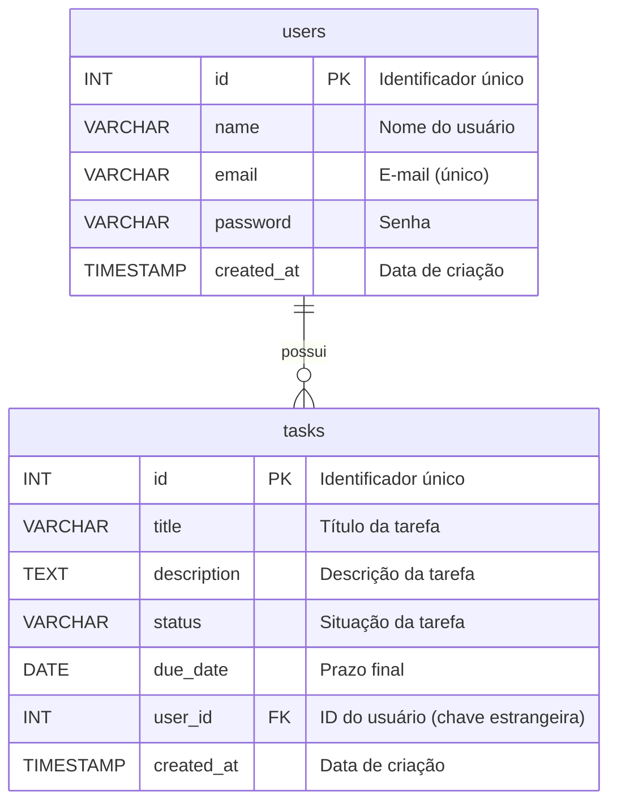

# Aula 05: Introdução a Bancos de Dados com PostgreSQL

## Visão geral

Até agora, nossa API armazenava dados em memória, o que significa que eles eram perdidos toda vez que o servidor reiniciava. Nesta aula, vamos dar o primeiro passo para tornar nossos dados persistentes, introduzindo o conceito de bancos de dados e aprendendo a modelar e criar tabelas com **PostgreSQL**, um dos sistemas de gerenciamento de banco de dados relacional (SGBD) mais poderosos e populares do mundo.

## Objetivos da aula

Ao final desta aula, você deverá ser capaz de:

- Diferenciar bancos de dados **SQL** (relacionais) e **NoSQL** (não relacionais).
- Compreender os conceitos básicos de modelagem de dados: entidades, atributos e relacionamentos.
- Modelar e criar a estrutura de tabelas para uma aplicação de gerenciamento de tarefas (`users` e `tasks`).
- Utilizar uma ferramenta de modelagem como o Draw.io (ou similar) para desenhar um diagrama entidade-relacionamento (DER).
- Escrever e executar scripts SQL para criar um banco de dados e suas tabelas no PostgreSQL.

## Roteiro para o Aluno

1.  **Leitura Conceitual**: Entenda as diferenças entre SQL e NoSQL e os fundamentos da modelagem de dados relacional.
2.  **Modelagem**: Desenhe o diagrama de banco de dados para as tabelas `users` e `tasks` usando uma ferramenta como o Draw.io.
3.  **Laboratório**: Siga as instruções no arquivo [laboratorio.md](laboratorio.md) para instalar o PostgreSQL, criar o banco de dados e executar os scripts SQL para criar as tabelas.

## Conceitos Fundamentais

### 1. Bancos de Dados SQL vs. NoSQL

A escolha do banco de dados é uma das decisões de arquitetura mais importantes em um projeto. A principal divisão se dá entre os modelos **SQL** e **NoSQL**.

#### SQL (Relacional)

- **O que é?** Bancos de dados relacionais organizam os dados em **tabelas** (como planilhas do Excel), que são compostas por **linhas** (registros) e **colunas** (atributos).
- **Estrutura**: Possuem um esquema **rígido e predefinido**. Você precisa definir a estrutura das tabelas antes de inserir os dados.
- **Linguagem**: Utilizam a **SQL (Structured Query Language)** para manipular e consultar os dados.
- **Exemplos**: **PostgreSQL**, MySQL, SQLite, SQL Server.
- **Ideal para**: Sistemas que exigem consistência, transações seguras e onde os dados têm uma estrutura bem definida (ex: sistemas financeiros, e-commerce, sistemas de gestão).

**Analogia didática**: Pense em um **guarda-roupa com divisórias fixas**. Cada gaveta (tabela) é projetada para guardar um tipo específico de roupa (dado), e todas as camisetas (registros) devem ter as mesmas características (colunas), como cor e tamanho.

#### NoSQL (Não Relacional)

- **O que é?** Bancos de dados não relacionais armazenam dados em formatos flexíveis, como documentos (JSON), grafos, chave-valor, etc.
- **Estrutura**: Possuem um esquema **flexível ou dinâmico**. Você pode adicionar registros com estruturas diferentes na mesma coleção.
- **Linguagem**: Cada banco NoSQL tem sua própria linguagem de consulta, embora muitos adotem APIs que lembram JSON.
- **Exemplos**: **MongoDB** (documentos), Redis (chave-valor), Neo4j (grafos).
- **Ideal para**: Aplicações que precisam de alta escalabilidade e flexibilidade, como redes sociais, Big Data, e sistemas onde o modelo de dados evolui rapidamente.

**Analogia didática**: Pense em uma **caixa de brinquedos**. Você pode guardar qualquer tipo de brinquedo (dado) nela, sem uma organização pré-definida. Um carro pode ter 4 rodas, enquanto uma boneca tem cabelo e braços. A estrutura é livre.

| Característica     | SQL (PostgreSQL)                                   | NoSQL (MongoDB)                                   |
| ------------------ | -------------------------------------------------- | ------------------------------------------------- |
| **Modelo**         | Relacional (tabelas, linhas, colunas)              | Documentos (coleções, documentos JSON/BSON)       |
| **Esquema**        | Rígido, predefinido                                | Flexível, dinâmico                                |
| **Escalabilidade** | Vertical (aumenta a potência do servidor)          | Horizontal (distribui dados em vários servidores) |
| **Consistência**   | Alta (garantia de transações ACID)                 | Eventual (foco em disponibilidade e performance)  |
| **Exemplo de Uso** | Sistema de gestão de tarefas com usuários e prazos | Feed de notícias de uma rede social               |

### 2. Modelagem de Dados Relacional

Modelar um banco de dados é o processo de desenhar a sua estrutura. Em um banco relacional, isso envolve identificar as **entidades**, seus **atributos** e como elas se **relacionam**.

- **Entidade**: Um objeto do mundo real sobre o qual queremos armazenar informações. Em nosso projeto, as entidades são `User` (Usuário) e `Task` (Tarefa).
- **Atributo**: Uma característica ou propriedade de uma entidade. Por exemplo, um `User` tem `name` e `email`. Uma `Task` tem `title` e `status`.
- **Relacionamento**: A forma como duas ou mais entidades se conectam. Em nosso caso, um `User` pode ter várias `Tasks`. Este é um relacionamento de **um-para-muitos (1-N)**.

### 3. Estrutura das Tabelas `users` e `tasks`

Para nosso projeto de gerenciamento de tarefas, precisamos de duas tabelas principais.

#### Tabela `users`

Esta tabela armazenará as informações dos usuários.

- `id`: Identificador único de cada usuário. Será nossa **chave primária (Primary Key)**.
- `name`: Nome do usuário.
- `email`: E-mail do usuário. Deve ser único.
- `password`: Senha do usuário (em um projeto real, armazenaríamos um hash, não a senha em texto plano).
- `created_at`: Data e hora em que o registro foi criado.

#### Tabela `tasks`

Esta tabela armazenará as tarefas.

- `id`: Identificador único de cada tarefa (**chave primária**).
- `title`: Título da tarefa.
- `description`: Descrição detalhada da tarefa.
- `status`: Situação da tarefa (ex: 'pendente', 'em andamento', 'concluída').
- `due_date`: Prazo final para a conclusão da tarefa.
- `user_id`: Identificador do usuário a quem a tarefa pertence. Esta é a nossa **chave estrangeira (Foreign Key)**, que cria o relacionamento com a tabela `users`.
- `created_at`: Data e hora de criação da tarefa.

#### Diagrama Entidade-Relacionamento (DER)

O diagrama abaixo, feito com Mermaid, ilustra a estrutura e o relacionamento entre as tabelas.

Este diagrama mostra que um `user` pode possuir muitas `tasks`, mas cada `task` pertence a apenas um `user`.

---

Agora que você entende a teoria, vamos para a prática! Acesse o [laboratorio.md](laboratorio.md) para criar seu banco de dados.
