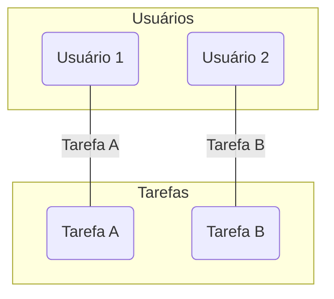
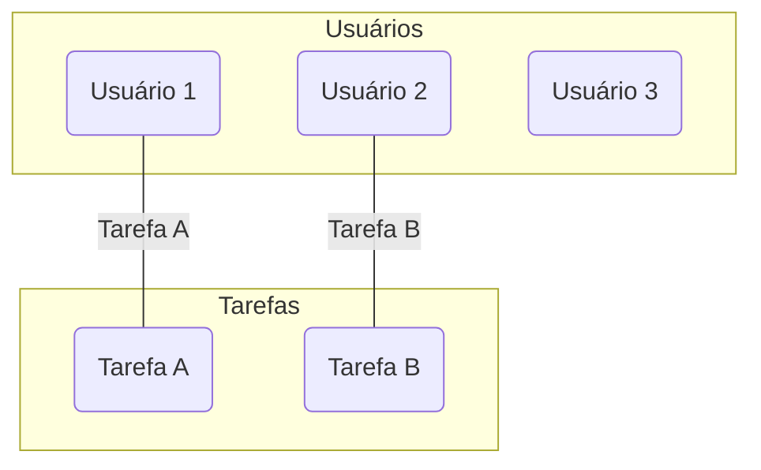
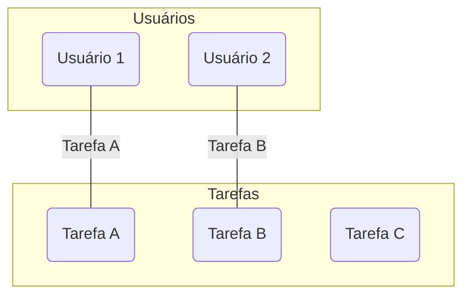
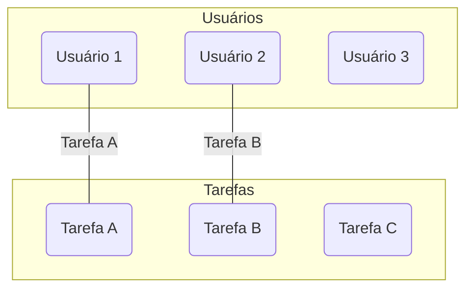
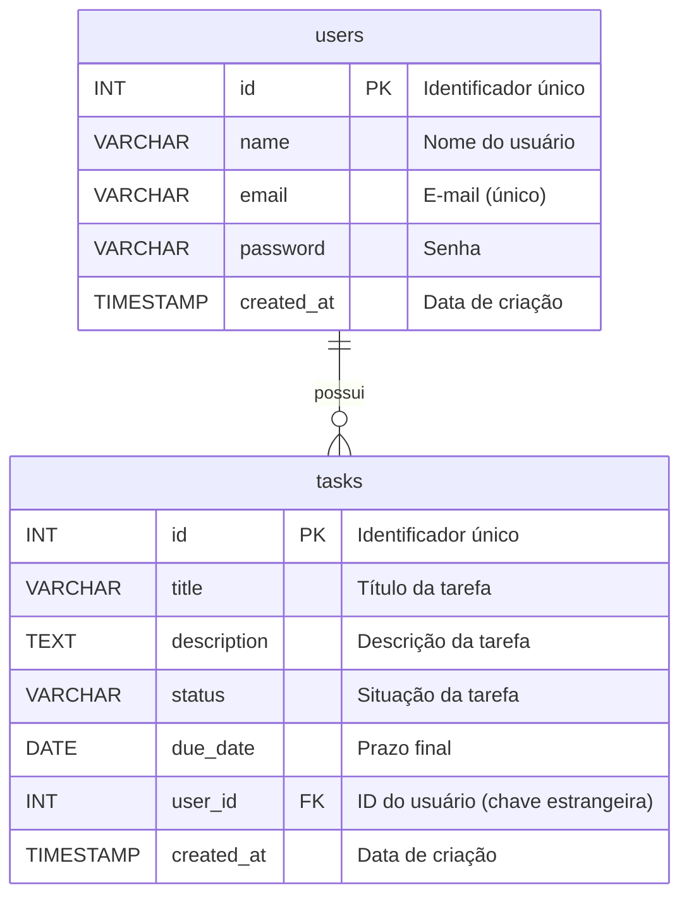

# Aula 05: Introdução a Bancos de Dados com PostgreSQL

## Visão geral

Até agora, nossa API armazenava dados em memória, o que significa que eles eram perdidos toda vez que o servidor reiniciava. Nesta aula, vamos dar o primeiro passo para tornar nossos dados persistentes, introduzindo o conceito de bancos de dados e aprendendo a modelar e criar tabelas com **PostgreSQL**, um dos sistemas de gerenciamento de banco de dados relacional (SGBD) mais poderosos e populares do mundo.

## Objetivos da aula

Ao final desta aula, você deverá ser capaz de:

- Diferenciar bancos de dados **SQL** (relacionais) e **NoSQL** (não relacionais).
- Compreender os conceitos básicos de modelagem de dados: entidades, atributos e relacionamentos.
- Modelar e criar a estrutura de tabelas para uma aplicação de gerenciamento de tarefas (`users` e `tasks`).
- Utilizar uma ferramenta de modelagem como o Draw.io (ou similar) para desenhar um diagrama entidade-relacionamento (DER).
- Escrever e executar scripts SQL para criar um banco de dados e suas tabelas no PostgreSQL.

## Roteiro para o Aluno

1.  **Leitura Conceitual**: Entenda as diferenças entre SQL e NoSQL e os fundamentos da modelagem de dados relacional.
2.  **Modelagem**: Desenhe o diagrama de banco de dados para as tabelas `users` e `tasks` usando uma ferramenta como o Draw.io.
3.  **Laboratório**: Siga as instruções no arquivo [laboratorio.md](laboratorio.md) para instalar o PostgreSQL, criar o banco de dados e executar os scripts SQL para criar as tabelas.

## Conceitos Fundamentais

### 1. Bancos de Dados SQL vs. NoSQL

A escolha do banco de dados é uma das decisões de arquitetura mais importantes em um projeto. A principal divisão se dá entre os modelos **SQL** e **NoSQL**.

#### SQL (Relacional)

- **O que é?** Bancos de dados relacionais organizam os dados em **tabelas** (como planilhas do Excel), que são compostas por **linhas** (registros) e **colunas** (atributos).
- **Estrutura**: Possuem um esquema **rígido e predefinido**. Você precisa definir a estrutura das tabelas antes de inserir os dados.
- **Linguagem**: Utilizam a **SQL (Structured Query Language)** para manipular e consultar os dados.
- **Exemplos**: **PostgreSQL**, MySQL, SQLite, SQL Server.
- **Ideal para**: Sistemas que exigem consistência, transações seguras e onde os dados têm uma estrutura bem definida (ex: sistemas financeiros, e-commerce, sistemas de gestão).

**Analogia didática**: Pense em um **guarda-roupa com divisórias fixas**. Cada gaveta (tabela) é projetada para guardar um tipo específico de roupa (dado), e todas as camisetas (registros) devem ter as mesmas características (colunas), como cor e tamanho.

#### NoSQL (Não Relacional)

- **O que é?** Bancos de dados não relacionais armazenam dados em formatos flexíveis, como documentos (JSON), grafos, chave-valor, etc.
- **Estrutura**: Possuem um esquema **flexível ou dinâmico**. Você pode adicionar registros com estruturas diferentes na mesma coleção.
- **Linguagem**: Cada banco NoSQL tem sua própria linguagem de consulta, embora muitos adotem APIs que lembram JSON.
- **Exemplos**: **MongoDB** (documentos), Redis (chave-valor), Neo4j (grafos).
- **Ideal para**: Aplicações que precisam de alta escalabilidade e flexibilidade, como redes sociais, Big Data, e sistemas onde o modelo de dados evolui rapidamente.

**Analogia didática**: Pense em uma **caixa de brinquedos**. Você pode guardar qualquer tipo de brinquedo (dado) nela, sem uma organização pré-definida. Um carro pode ter 4 rodas, enquanto uma boneca tem cabelo e braços. A estrutura é livre.

| Característica     | SQL (PostgreSQL)                                   | NoSQL (MongoDB)                                   |
| ------------------ | -------------------------------------------------- | ------------------------------------------------- |
| **Modelo**         | Relacional (tabelas, linhas, colunas)              | Documentos (coleções, documentos JSON/BSON)       |
| **Esquema**        | Rígido, predefinido                                | Flexível, dinâmico                                |
| **Escalabilidade** | Vertical (aumenta a potência do servidor)          | Horizontal (distribui dados em vários servidores) |
| **Consistência**   | Alta (garantia de transações ACID)                 | Eventual (foco em disponibilidade e performance)  |
| **Exemplo de Uso** | Sistema de gestão de tarefas com usuários e prazos | Feed de notícias de uma rede social               |

### 2. Tipos de Dados no PostgreSQL

O PostgreSQL é conhecido por seu sistema de tipos robusto e extensível. A escolha correta dos tipos de dados é fundamental para a integridade e performance do banco de dados.

**Tipos de Dados Comuns (Padrão SQL):**

| Categoria     | Tipo            | Descrição                                 | Exemplo                             |
| :------------ | :-------------- | :---------------------------------------- | :---------------------------------- |
| **Numéricos** | `INTEGER`       | Números inteiros.                         | `42`                                |
|               | `NUMERIC(p, s)` | Números decimais com precisão exata.      | `NUMERIC(10, 2)` para `99999999.99` |
|               | `FLOAT`         | Números de ponto flutuante (aproximados). | `3.14159`                           |
| **Texto**     | `VARCHAR(n)`    | String com tamanho máximo variável.       | `VARCHAR(255)`                      |
|               | `TEXT`          | String com tamanho ilimitado.             | `'Uma longa descrição...'`          |
| **Data/Hora** | `DATE`          | Armazena apenas a data.                   | `'2024-10-26'`                      |
|               | `TIME`          | Armazena apenas a hora.                   | `'14:30:00'`                        |
|               | `TIMESTAMP`     | Armazena data e hora.                     | `'2024-10-26 14:30:00'`             |
| **Lógicos**   | `BOOLEAN`       | Verdadeiro (`true`) ou falso (`false`).   | `true`                              |

**Tipos de Dados Específicos e Avançados do PostgreSQL:**

| Categoria         | Tipo           | Descrição                                                                                            | Exemplo de Uso                                                     |
| :---------------- | :------------- | :--------------------------------------------------------------------------------------------------- | :----------------------------------------------------------------- |
| **Estruturado**   | `JSON`/`JSONB` | Armazena dados no formato JSON. **JSONB** é binário, mais rápido para consultas e suporta indexação. | Guardar configurações de um usuário ou metadados de um produto.    |
| **Array**         | `TIPO[]`       | Permite que uma coluna armazene um array de valores de um mesmo tipo.                                | `tags TEXT[]` para armazenar uma lista de tags em um post de blog. |
| **Identificador** | `UUID`         | Identificador Único Universal, ideal para chaves primárias em sistemas distribuídos.                 | `a0eebc99-9c0b-4ef8-bb6d-6bb9bd380a11`                             |

### 3. Modelagem de Dados Relacional

Modelar um banco de dados é o processo de desenhar a sua estrutura. Em um banco relacional, isso envolve identificar as **entidades**, seus **atributos** e como elas se **relacionam**.

- **Entidade**: Um objeto do mundo real sobre o qual queremos armazenar informações. Em nosso projeto, as entidades são `User` (Usuário) e `Task` (Tarefa).
- **Atributo**: Uma característica ou propriedade de uma entidade. Por exemplo, um `User` tem `name` e `email`. Uma `Task` tem `title` e `status`.
- **Relacionamento**: A forma como duas ou mais entidades se conectam. Em nosso caso, um `User` pode ter várias `Tasks`. Este é um relacionamento de **um-para-muitos (1-N)**.

### 4. Estrutura das Tabelas `users` e `tasks`

Para nosso projeto de gerenciamento de tarefas, precisamos de duas tabelas principais.

#### Tabela `users`

Esta tabela armazenará as informações dos usuários.

- `id`: Identificador único de cada usuário. Será nossa **chave primária (Primary Key)**.
- `name`: Nome do usuário.
- `email`: E-mail do usuário. Deve ser único.
- `password`: Senha do usuário (em um projeto real, armazenaríamos um hash, não a senha em texto plano).
- `created_at`: Data e hora em que o registro foi criado.

#### Tabela `tasks`

Esta tabela armazenará as tarefas.

- `id`: Identificador único de cada tarefa (**chave primária**).
- `title`: Título da tarefa.
- `description`: Descrição detalhada da tarefa.
- `status`: Situação da tarefa (ex: 'pendente', 'em andamento', 'concluída').
- `due_date`: Prazo final para a conclusão da tarefa.
- `user_id`: Identificador do usuário a quem a tarefa pertence. Esta é a nossa **chave estrangeira (Foreign Key)**, que cria o relacionamento com a tabela `users`.
- `created_at`: Data e hora de criação da tarefa.

### 5. Consultas com JOINs: Conectando Tabelas

O verdadeiro poder de um banco de dados relacional aparece quando combinamos dados de múltiplas tabelas. A cláusula `JOIN` é usada para isso, baseando-se em uma coluna relacionada entre elas (geralmente a chave primária de uma tabela e a chave estrangeira de outra).

Vamos visualizar os tipos de `JOIN` mais comuns. Imagine que temos uma tabela de `users` e uma de `tasks`.

#### INNER JOIN

Retorna apenas os registros que têm correspondência em **ambas** as tabelas. É o tipo de `JOIN` mais comum.

- **Pergunta**: "Quais tarefas pertencem a quais usuários?" (só mostra usuários que têm tarefas).



#### LEFT JOIN (ou LEFT OUTER JOIN)

Retorna **todos** os registros da tabela da esquerda (`users`) e os registros correspondentes da tabela da direita (`tasks`). Se não houver correspondência, os campos da tabela da direita virão como `NULL`.

- **Pergunta**: "Liste todos os usuários e suas tarefas, incluindo os usuários que ainda não têm nenhuma tarefa."



#### RIGHT JOIN (ou RIGHT OUTER JOIN)

É o inverso do `LEFT JOIN`. Retorna **todos** os registros da tabela da direita (`tasks`) e os correspondentes da tabela da esquerda (`users`). Se não houver correspondência, os campos da tabela da esquerda virão como `NULL`.

- **Pergunta**: "Liste todas as tarefas e seus usuários, incluindo tarefas que (hipoteticamente) não estivessem associadas a nenhum usuário."



#### FULL OUTER JOIN

Retorna todos os registros quando há uma correspondência em uma das tabelas (esquerda ou direita). Combina a funcionalidade do `LEFT` e `RIGHT JOIN`.

- **Pergunta**: "Liste todas as associações possíveis entre usuários e tarefas, mostrando usuários sem tarefas e tarefas sem usuários."



#### Diagrama Entidade-Relacionamento (DER)

O diagrama abaixo, feito com Mermaid, ilustra a estrutura e o relacionamento entre as tabelas.



Este diagrama mostra que um `user` pode possuir muitas `tasks`, mas cada `task` pertence a apenas um `user`.

---

## Dicas de Banco de Dados: MySQL vs PostgreSQL vs SQL Server vs Oracle

É muito comum encontrar diferenças de sintaxe entre sistemas de gerenciamento de bancos de dados (SGBDs). A tabela abaixo compara alguns dos comandos mais comuns.

| Funcionalidade                     | MySQL                                               | PostgreSQL                                                            | SQL Server                                                              | Oracle                                                                |
| :--------------------------------- | :-------------------------------------------------- | :-------------------------------------------------------------------- | :---------------------------------------------------------------------- | :-------------------------------------------------------------------- |
| **Selecionar o Banco de Dados**    | `USE nome_do_banco;`                                | `\c nome_do_banco` (no psql)                                          | `USE nome_do_banco;`                                                    | `ALTER SESSION SET CURRENT_SCHEMA = nome_do_schema;`                  |
| **Chave Primária Auto-Incremento** | `INT AUTO_INCREMENT PRIMARY KEY`                    | `SERIAL PRIMARY KEY` ou `BIGSERIAL PRIMARY KEY`                       | `INT IDENTITY(1,1) PRIMARY KEY`                                         | `NUMBER GENERATED BY DEFAULT AS IDENTITY PRIMARY KEY`                 |
| **Limitar Resultados (TOP N)**     | `SELECT * FROM tabela LIMIT 10;`                    | `SELECT * FROM tabela LIMIT 10;`                                      | `SELECT TOP 10 * FROM tabela;`                                          | `SELECT * FROM tabela FETCH FIRST 10 ROWS ONLY;` (Oracle 12c+)        |
| **Concatenação de Strings**        | `CONCAT(str1, str2)`                                | `str1 \|\| str2` ou `CONCAT(str1, str2)`                              | `str1 + str2` ou `CONCAT(str1, str2)`                                   | `str1 \|\| str2` ou `CONCAT(str1, str2)`                              |
| **Data e Hora Atuais**             | `NOW()`                                             | `NOW()` ou `CURRENT_TIMESTAMP`                                        | `GETDATE()` ou `SYSDATETIME()`                                          | `SYSDATE` ou `CURRENT_TIMESTAMP`                                      |
| **Funções de Data (Extrair Ano)**  | `YEAR(data)`                                        | `EXTRACT(YEAR FROM data)`                                             | `YEAR(data)`                                                            | `EXTRACT(YEAR FROM data)`                                             |
| **Tratamento de Nulos (IFNULL)**   | `IFNULL(coluna, 'valor')`                           | `COALESCE(coluna, 'valor')`                                           | `ISNULL(coluna, 'valor')` ou `COALESCE(coluna, 'valor')`                | `NVL(coluna, 'valor')` ou `COALESCE(coluna, 'valor')`                 |
| **Estrutura Condicional (IF)**     | `IF(condicao, valor_se_verdadeiro, valor_se_falso)` | `CASE WHEN condicao THEN valor_se_verdadeiro ELSE valor_se_falso END` | `IIF(condicao, valor_se_verdadeiro, valor_se_falso)` (SQL Server 2012+) | `CASE WHEN condicao THEN valor_se_verdadeiro ELSE valor_se_falso END` |
| **Tipos de Dados (Texto)**         | `VARCHAR`, `TEXT`                                   | `VARCHAR`, `TEXT`                                                     | `VARCHAR`, `NVARCHAR`                                                   | `VARCHAR2`, `CLOB`                                                    |
| **Tipos de Dados (JSON)**          | `JSON` (MySQL 5.7+)                                 | `JSON`, `JSONB`                                                       | `NVARCHAR(MAX)` com `FOR JSON` (SQL Server 2016+)                       | `JSON` (Oracle 21c+), `VARCHAR2` ou `CLOB` com constraints            |

### Dicas Importantes para PostgreSQL

1.  **Conexão é a Chave**: No PostgreSQL, a seleção do banco de dados é feita no momento da conexão. Em ferramentas como DBeaver ou pgAdmin, sempre verifique qual banco de dados está ativo antes de executar um script de criação (`CREATE TABLE`).
2.  **Use o `\c` no psql**: Se você estiver usando o terminal `psql`, o comando `\c nome_do_banco` encerra a conexão atual e abre uma nova no banco de dados especificado.
3.  **Schemas para Organização**: O PostgreSQL usa "schemas" para organizar objetos. Para ser explícito, você pode usar `CREATE TABLE public.minha_tabela (...)` para garantir que a tabela seja criada no schema `public` do banco de dados conectado.

---

### 6. Acessando o PostgreSQL via Linha de Comando (psql)

Embora ferramentas com interface gráfica como o DBeaver sejam excelentes, todo desenvolvedor precisa saber como interagir com o banco de dados diretamente pelo terminal. O `psql` é o cliente de linha de comando interativo para o PostgreSQL.

#### Como Acessar

**No Windows:**

1.  Abra o **SQL Shell (psql)**, que é instalado junto com o PostgreSQL.
2.  Ele solicitará informações de conexão (servidor, banco, porta, usuário). Você pode pressionar Enter para aceitar os valores padrão.
3.  Por fim, digite a senha do usuário `postgres`.

Alternativamente, se o diretório `bin` do PostgreSQL estiver no `PATH` do sistema, você pode abrir um terminal (cmd ou PowerShell) e digitar:

```bash
psql -U postgres
```

**No Linux (e macOS):**

1.  Abra um terminal.
2.  O PostgreSQL cria um usuário no sistema operacional com o mesmo nome do superusuário do banco (`postgres`). Para se conectar, use o `sudo`:

```bash
sudo -u postgres psql
```

#### Comandos Úteis no psql

Uma vez dentro do `psql`, você pode executar comandos SQL normalmente. Além disso, ele possui "meta-comandos" que começam com uma barra invertida (`\`).

| Comando             | Descrição                                                   |
| :------------------ | :---------------------------------------------------------- |
| `\l` ou `\list`     | Lista todos os bancos de dados no servidor.                 |
| `\c nome_do_banco`  | Conecta a um banco de dados específico.                     |
| `\dt`               | Lista todas as tabelas no banco de dados atual.             |
| `\d nome_da_tabela` | Descreve a estrutura de uma tabela (colunas, tipos).        |
| `\dn`               | Lista todos os schemas.                                     |
| `\df`               | Lista todas as funções.                                     |
| `\dv`               | Lista todas as views.                                       |
| `\timing`           | Ativa/desativa a exibição do tempo de execução das queries. |
| `\q`                | Sai do psql.                                                |

---

Agora que você entende a teoria, vamos para a prática! Acesse o [laboratorio.md](laboratorio.md) para criar seu banco de dados.
