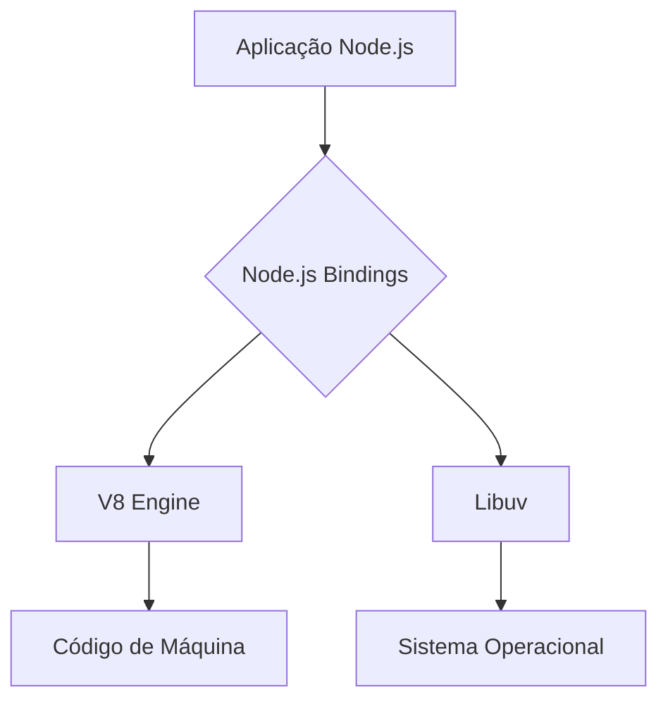
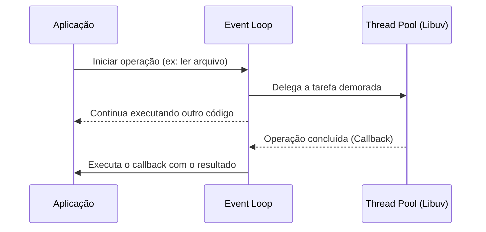
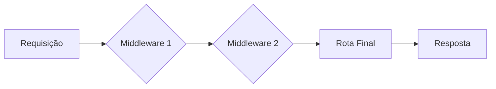

# Capacitação em Desenvolvimento Full Stack

## Módulo 05: Desenvolvimento Back-end com Node.js e Express

Esta apostila centraliza o conteúdo do curso, servindo como guia de referência completo para os alunos.

---

## Sumário

1.  [Introdução ao Node.js](#1--introdução-ao-nodejs)
2.  [Desenvolvimento Web com Express.js](#2--desenvolvimento-web-com-expressjs)
3.  [Bancos de Dados com Node.js](#3--bancos-de-dados-com-nodejs-postgresql-e-overview-mongodb)
4.  [APIs RESTful com Express.js](#4--apis-restful-com-expressjs)
5.  [Projeto Prático, Testes e Deploy](#5--projeto-prático-testes-e-deploy)

---

## 0 - A História

### 0.1 Do Navegador ao Poder do Servidor

A história do Node.js é a história da emancipação do JavaScript. Criado em 1995 para rodar apenas em navegadores, o JavaScript era visto como uma linguagem "brinquedo". Tudo mudou em 2009, quando Ryan Dahl apresentou o Node.js na JSConf EU.

**A Dor do Problema:** Dahl estava frustrado com a forma como servidores tradicionais (como o Apache) lidavam com múltiplas conexões. Eles criavam uma "thread" para cada usuário, o que consumia muita memóri­a e travava o sistema em operações de leitura de arquivos ou banco de dados.

A proposta de Dahl era executar o JavaScript no servidor, usando eventos e operações assíncronas para melhorar o desempenho e o uso de recursos. Dessa forma o Node.js evoluiu rapidamente, impulsionado por milhares de pacotes e frameworks como Express.js, tornando-se essencial tanto em projetos pequenos quanto grandes.

#### Linha do tempo da Evolução:

| Ano   | Marco Histórico          | Impacto no Ecossistema                                |
| :---- | :----------------------- | :---------------------------------------------------- |
| 2009  | Lançamento por Ryan Dahl | JavaScript chega oficialmente ao servidor.            |
| 2010  | Criação do npm           | Início da explosão de bibliotecas reutilizáveis.      |
| 2015  | Fundação Node.js         | Governança aberta e profissionalização da plataforma. |
| 2020+ | Domínio de Mercado       | Escolha nº 1 para Microsserviços e APIs Escaláveis.   |

Compreender essa trajetória é importante porque mostra que o Node.js não surgiu apenas como uma nova ferramenta, mas como resposta a uma necessidade real de desempenho e escalabilidade no desenvolvimento de software.

---

## 1 - Introdução ao Node.js

### 1.1 Visão Geral e Arquitetura

Node.js é um **runtime** que permite executar código JavaScript fora do navegador, geralmente no lado do servidor. Ele é construído sobre o motor **V8**, o mesmo que interpreta JavaScript no Google Chrome, oferecendo alta performance.

- **V8 Engine**: O motor JavaScript de alta performance do Google Chrome.
- **Libuv**: Biblioteca C que implementa o Event Loop e gerencia operações de I/O assíncronas.
- **Node.js Bindings**: Camada que conecta o JavaScript às funcionalidades de baixo ní­vel (C++).

### 1.2 O Coração: Event Loop e I/O Não Bloqueante

O **Event Loop** é o coração do Node.js. Ele permite que o servidor atenda a muitas requisições concorrentes sem bloquear a execução para cada acesso a disco ou rede.

**Analogia do Restaurante:**

- **Modelo Tradicional (Bloqueante)**: O garçom anota o pedido e fica parado na frente da cozinha esperando o prato ficar pronto. Ele não atende mais ninguém enquanto espera.
- **Modelo Node.js (Não Bloqueante)**: O garçom anota o pedido, entrega na cozinha e vai atender outras mesas. Quando o prato fica pronto, um sino toca e ele o entrega, sem ter parado de atender outros clientes.

### 1.3 Assincronismo em Node.js

O assincronismo é a forma padrão de lidar com tarefas demoradas. As formas de lidar com isso evoluíram:

1.  **Callbacks**: Funções passadas como parâmetro para serem executadas no final.
2.  **Promises**: Objetos que representam a conclusão (ou falha) de uma operação.
3.  **Async/Await**: Sintaxe mais limpa para trabalhar com Promises, tornando o código mais legível.

### 1.4 Instalação e Configuração do Ambiente

Para começar, instale a versão LTS do site oficial: [https://nodejs.org](https://nodejs.org).
Verifique no terminal se os comandos `node -v` e `npm -v` funcionam.

### 1.5 Módulos em Node.js

A base da organização de código em Node.js são os módulos. O formato tradicional é o **CommonJS**.

- `require`: Para importar módulos.
- `module.exports`: Para exportar funções, objetos ou valores.

### 1.6 Gerenciamento de Pacotes com NPM

O **npm (Node Package Manager)** é o gerenciador de pacotes do Node.js. O arquivo `package.json` descreve o projeto e suas dependências.

**Comandos Essenciais:**

- `npm init -y`: Cria um `package.json` padrão.
- `npm install <pacote>`: Instala um pacote.
- `npm install -D <pacote>`: Instala um pacote de desenvolvimento.
- `npm run <script>`: Executa um script personalizado.

---

## 2 - Desenvolvimento Web com Express.js

### 2.1 O que é o Express?

Se o Node.js é o motor, o Express é a carroceria. É um framework web minimalista e flexível que simplifica a criação de servidores e APIs.

### 2.2 Rotas e Métodos HTTP

As rotas definem "onde" o usuário vai e "o que" ele quer fazer, usando os métodos HTTP (GET, POST, PUT, DELETE).

### 2.3 Middlewares: O "Pedágio" da Requisição

Um middleware é uma função que roda entre o pedido do usuário e a resposta final. Eles podem executar qualquer código, fazer alterações nos objetos de requisição e resposta, ou finalizar o ciclo.

### 2.4 Middlewares Nativos e de Terceiros

- **Nativos**: `express.json()`, `express.urlencoded()`.
- **Terceiros**: `cors`, `morgan`, `helmet`.

### 2.5 Autenticação e Autorização com Middlewares

- **Autenticação**: Verifica a identidade do usuário.
- **Autorização**: Controla o que um usuário autenticado pode fazer.

### 2.6 Tratamento de Erros e Logging

- **Logging**: Um middleware que registra informações sobre cada requisição.
- **Tratamento de Erros**: Um middleware especial que captura erros e envia uma resposta padronizada.

---

## 3 - Bancos de Dados com Node.js (PostgreSQL e overview MongoDB)

### 3.1 Introdução a Bancos de Dados SQL e NoSQL

| Característica  | SQL (PostgreSQL)               | NoSQL (MongoDB)            |
| :-------------- | :----------------------------- | :------------------------- |
| **Estrutura**   | Tabelas fixas (Rígido)         | Documentos JSON (Flexível) |
| **Relações**    | Excelente para dados complexos | Melhor para dados isolados |
| **Integridade** | Alta (ACID)                    | Foco em Velocidade/Escala  |

### 3.2 Conceitos Básicos do PostgreSQL

PostgreSQL é um sistema de banco de dados relacional. Usamos tabelas, colunas e chaves (primárias e estrangeiras) para modelar os dados.

### 3.2.1 Tipos de Dados no PostgreSQL

O PostgreSQL é conhecido por seu sistema de tipos robusto e extensível. Compreender os tipos de dados é fundamental para modelar o banco de dados de forma correta e otimizada.

**Tipos de Dados Comuns (Padrão SQL):**

| Categoria     | Tipo            | Descrição                                 | Exemplo                             |
| :------------ | :-------------- | :---------------------------------------- | :---------------------------------- |
| **Numéricos** | `INTEGER`       | Números inteiros.                         | `42`                                |
|               | `NUMERIC(p, s)` | Números decimais com precisão exata.      | `NUMERIC(10, 2)` para `99999999.99` |
|               | `FLOAT`         | Números de ponto flutuante (aproximados). | `3.14159`                           |
| **Texto**     | `VARCHAR(n)`    | String com tamanho máximo variável.       | `VARCHAR(255)`                      |
|               | `TEXT`          | String com tamanho ilimitado.             | `'Uma longa descrição...'`          |
| **Data/Hora** | `DATE`          | Armazena apenas a data.                   | `'2024-10-26'`                      |
|               | `TIME`          | Armazena apenas a hora.                   | `'14:30:00'`                        |
|               | `TIMESTAMP`     | Armazena data e hora.                     | `'2024-10-26 14:30:00'`             |
| **Lógicos**   | `BOOLEAN`       | Verdadeiro (`true`) ou falso (`false`).   | `true`                              |

**Tipos de Dados Específicos e Avançados do PostgreSQL:**

O que realmente diferencia o PostgreSQL são seus tipos de dados nativos que simplificam o desenvolvimento e melhoram a performance.

| Categoria         | Tipo            | Descrição                                                                                            | Exemplo de Uso                                                     |
| :---------------- | :-------------- | :--------------------------------------------------------------------------------------------------- | :----------------------------------------------------------------- |
| **Estruturado**   | `JSON`/`JSONB`  | Armazena dados no formato JSON. **JSONB** é binário, mais rápido para consultas e suporta indexação. | Guardar configurações de um usuário ou metadados de um produto.    |
| **Array**         | `TIPO[]`        | Permite que uma coluna armazene um array de valores de um mesmo tipo.                                | `tags TEXT[]` para armazenar uma lista de tags em um post de blog. |
| **Geométrico**    | `POINT`, `LINE` | Tipos para dados geométricos e espaciais.                                                            | Armazenar coordenadas geográficas (`POINT(lat, lon)`).             |
| **Identificador** | `UUID`          | Identificador Único Universal, ideal para chaves primárias em sistemas distribuídos.                 | `a0eebc99-9c0b-4ef8-bb6d-6bb9bd380a11`                             |
| **Intervalo**     | `INT4RANGE`     | Representa um intervalo de inteiros.                                                                 | `INT4RANGE(1, 10)` para representar "de 1 a 10".                   |

### 3.3 Modelagem de Dados Relacional

Identificamos entidades e seus atributos. Por exemplo, uma tabela `users` e uma `tasks`, onde cada tarefa pertence a um usuário.

### 3.4 Conexão do Node.js com PostgreSQL

Usamos o pacote `pg` para conectar a aplicação Node.js ao PostgreSQL.

### 3.5 Operações CRUD na Prática

- **C**reate: `INSERT`
- **R**ead: `SELECT`
- **U**pdate: `UPDATE`
- **D**elete: `DELETE`

### 3.6 Visão Geral do MongoDB (NoSQL)

MongoDB é um banco de dados orientado a documentos, onde os dados são armazenados em formato BSON (similar a JSON).

---

## 4 - APIs RESTful com Express.js

### 4.1 Conceitos de APIs e REST

Uma **API** (Application Programming Interface) permite que sistemas troquem dados. **REST** (Representational State Transfer) é um estilo de arquitetura para criar APIs.

**Princípios REST:**

- Uso de métodos HTTP (GET, POST, PUT, DELETE).
- Recursos identificados por URLs (ex: `/users`, `/users/1`).
- Comunicação sem estado (stateless).

### 4.2 Padrões de Resposta (Status Codes)

Os códigos de status HTTP informam o resultado da requisição.

| Código | Significado           | Exemplo de Uso                          |
| :----- | :-------------------- | :-------------------------------------- |
| 200    | OK                    | Sucesso em GET, PUT, DELETE.            |
| 201    | Created               | Sucesso em um POST que cria um recurso. |
| 204    | No Content            | Sucesso em um DELETE.                   |
| 400    | Bad Request           | Dados de entrada inválidos.             |
| 401    | Unauthorized          | Falha na autenticação (sem token).      |
| 403    | Forbidden             | Usuário sem permissão para a ação.      |
| 404    | Not Found             | Recurso não encontrado.                 |
| 500    | Internal Server Error | Erro inesperado no servidor.            |

### 4.3 Estrutura de uma API RESTful em Express

Organizamos o código em rotas, controladores e serviços para manter o projeto legível e escalável.

### 4.4 Documentação de APIs com Swagger e Postman

- **Postman**: Ferramenta para testar e criar coleções de requisições.
- **Swagger (OpenAPI)**: Padrão para descrever e documentar APIs, gerando uma interface interativa.

---

## 5 - Projeto Prático, Testes e Deploy

### 5.1 Visão Geral do Projeto Integrador

O objetivo é aplicar todos os conceitos aprendidos em um projeto prático.

### 5.2 Organização do Código e Boas Práticas

Seguir padrões de projeto para manter o código limpo e manutenível.

### 5.3 Introdução a Testes Unitários

Testes que verificam a menor parte de uma aplicação (uma função, um método) de forma isolada.

### 5.4 Noções de Testes de Integração

Testes que verificam a interação entre diferentes partes do sistema (ex: API e banco de dados).

### 5.5 Preparaçãe Deploy

**Deploy** é o processo de publicar a aplicação em um servidor para que ela fique acessível na internet.
